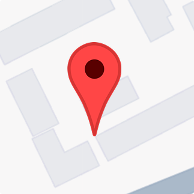

<h1>
  
  BRB
</h1>

BRB is a Flutter safety companion that combines live location, motion and proximity sensors, camera access, configurable presets, and an event history in one mobile app.

<p align="center">
  
</p>

## Features

- Live GPS tracking and location permission management
- Motion, step, proximity, and orientation sensor monitoring
- In-app camera preview and photo capture
- Configurable safety presets and event history
- Dark-mode, notification, sound, and vibration preferences

## Getting Started

```bash
flutter pub get
flutter run
```

## Tech

- Flutter · Dart · `geolocator` · `camera` · `sensors_plus` · `pedometer`

> The project does not currently include a dedicated screenshot/design folder. The map above is an existing project visual asset; add device screenshots here when available.
