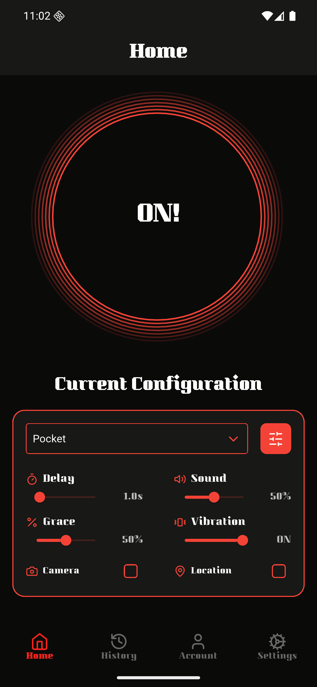
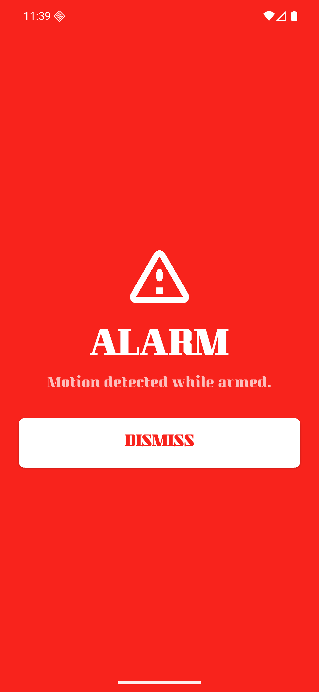
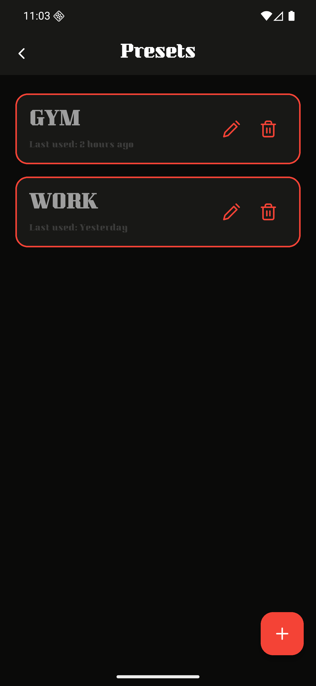
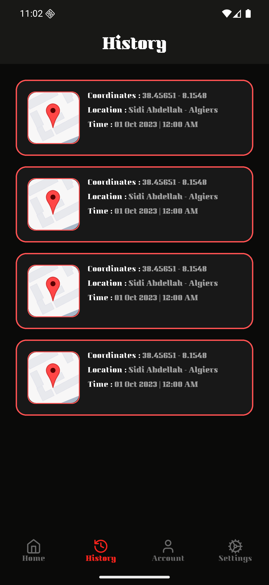
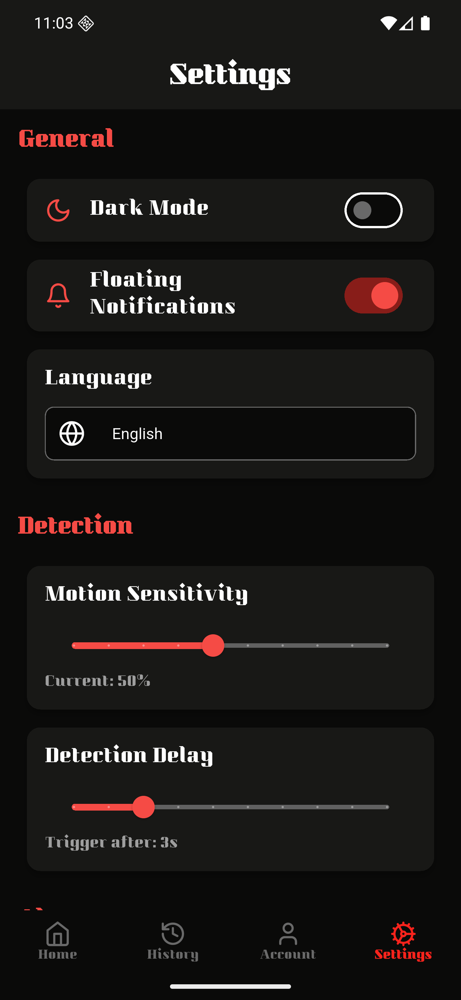
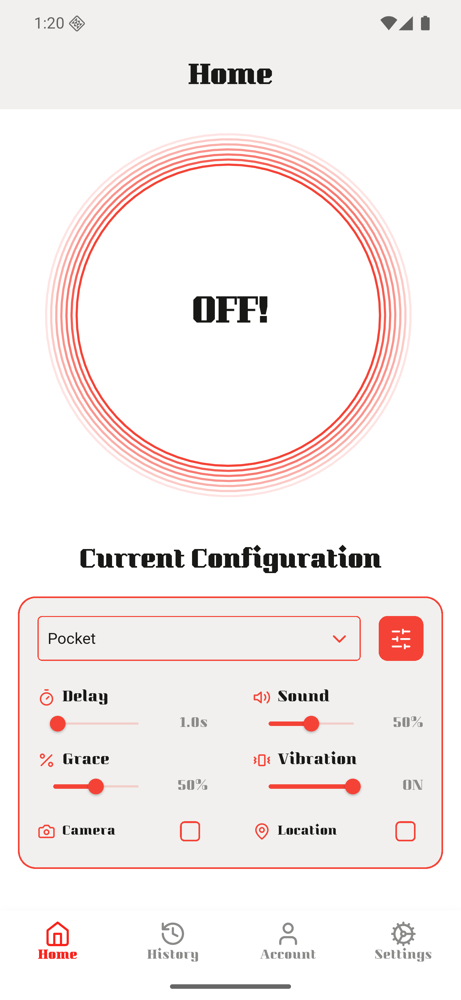

<h1>
  
  BRB
</h1>

**BRB** is a Flutter app that watches your phone's motion, proximity, and location sensors while you're away from it, and alarms when someone picks it up or walks off with it. Built with Dart, `geolocator`, `sensors_plus`, `proximity_sensor`, `pedometer`, `camera`, and `geocoding`.

## Screenshots

<p align="center">
  
  
  
  
  
  
</p>

## How it works

Arming Home starts `DetectionService`, which watches the sensors for the active mode and fires once a reading holds past threshold for the configured delay:

- **Pocket** - sudden motion, or the proximity sensor going from covered to uncovered
- **Sensitive** - same motion check, much lower threshold
- **Distant** - GPS distance from the arm point exceeds a configurable max range
- **Steps** - step counter advances past a configurable threshold

On trigger, `AlarmController` vibrates, plays the alarm sound (a custom file picked in Settings if one's set, otherwise the system alert sound), optionally snaps a photo and grabs a GPS fix (per the active config), reverse-geocodes that fix into a place name when possible, logs the event to History, and shows a full-screen alarm that blocks the back gesture and (if a PIN is set in Settings) requires it to dismiss.

Presets, the Home configuration card, History events, and Account profile fields all persist via `shared_preferences` - nothing resets on restart.

## Configurable

Nearly every part of detection is user-tunable in Settings, not hardcoded:

- Motion sensitivity, detection delay, steps threshold (Steps mode), max distance (Distant mode)
- Custom alarm sound, picked from device files/ringtones via the system picker
- PIN lock for dismissing a triggered alarm
- Light/dark theme, applied live app-wide

## Known limitations

- Detection is heuristic (accelerometer-magnitude/proximity/GPS/step thresholds against user-set numbers), not ML-based - it can false-trigger on a hard bump or miss a very gentle pickup.
- The built-in alarm "tone" dropdown (Siren, Loud Beep, etc.) is cosmetic labeling - only a custom-picked sound file changes the actual audio played; otherwise it's the system alert sound.
- Reverse geocoding is best-effort: no network or no geocoder on the device silently falls back to raw coordinates.
- No automated tests.

## Tech

- Flutter · Dart
- `geolocator`, `sensors_plus`, `proximity_sensor`, `pedometer`, `camera`, `permission_handler`, `vibration`, `geocoding`
- `shared_preferences`, `image_picker`, `path_provider`, `url_launcher`, `file_picker`, `audioplayers`

## Getting Started

```bash
flutter pub get
flutter run
```
</content>
