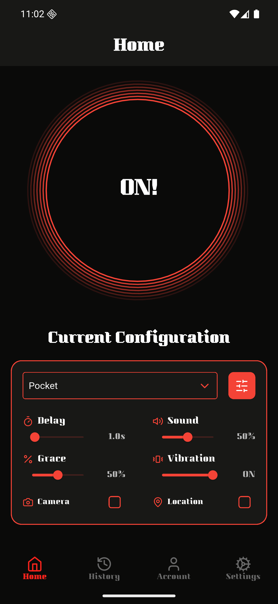
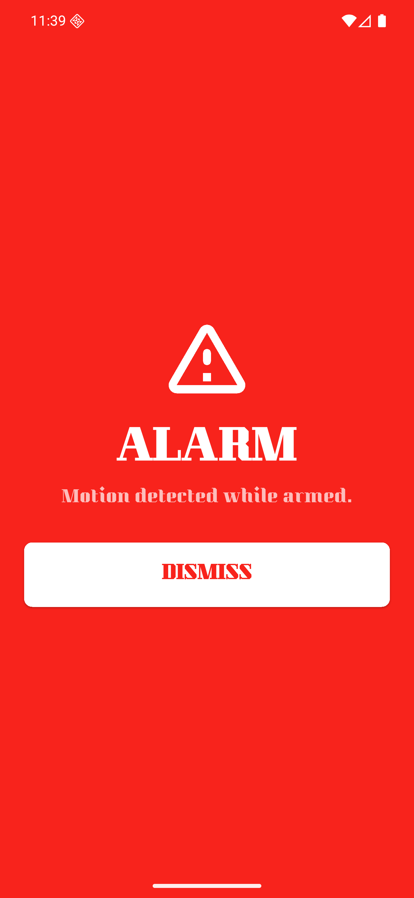
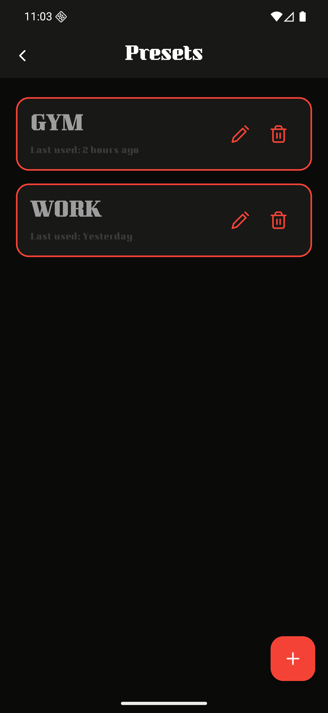
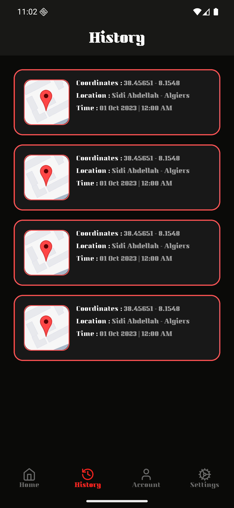
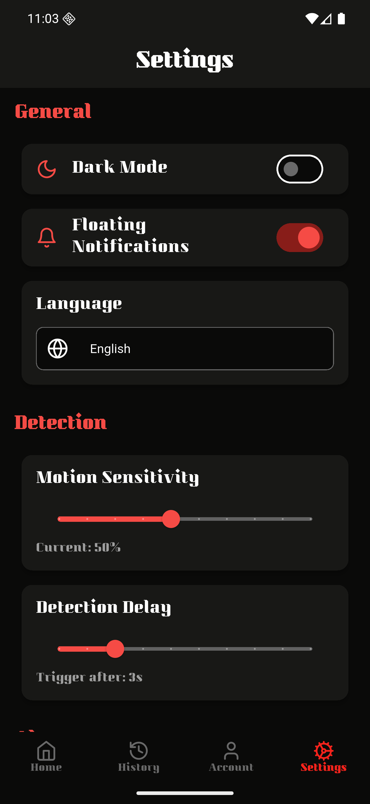
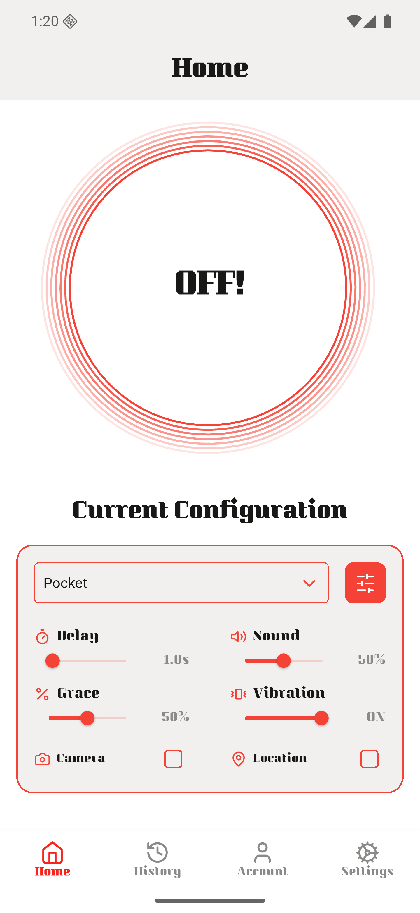

<h1>
  
  BRB
</h1>

**BRB** is a Flutter app that watches your phone's motion, proximity, and location sensors while you're away from it, and alarms when someone picks it up or walks off with it. Built with Dart, `geolocator`, `sensors_plus`, `proximity_sensor`, `pedometer`, `camera`, and `geocoding`.

## Screenshots

<p align="center">
  
  
  
  
  
  
</p>

## How it works

Arming Home starts `DetectionService`, which watches the sensors for the active mode and fires once a reading holds past threshold for the configured delay:

- **Pocket** - sudden motion, or the proximity sensor going from covered to uncovered
- **Sensitive** - same motion check, much lower threshold
- **Distant** - GPS distance from the arm point exceeds a configurable max range
- **Steps** - step counter advances past a configurable threshold

On trigger, `AlarmController` vibrates, plays the alarm sound (a custom file picked in Settings if one's set, otherwise a built-in tone), optionally snaps a photo, records an audio clip, and grabs a GPS fix (per the active config), reverse-geocodes that fix into a place name when possible, logs the event to History, and shows a full-screen alarm that blocks the back gesture and (if a PIN or digit code is set for that preset) requires it to dismiss.

While armed, a persistent notification shows the armed status. Presets, the Home configuration card, History events, and Account profile fields all persist via `shared_preferences` - nothing resets on restart. The UI is available in English and French.

## Configurable

Nearly every part of detection is user-tunable in Settings, not hardcoded:

- Motion sensitivity, detection delay, steps threshold (Steps mode), max distance (Distant mode)
- Built-in alarm tone (Siren, Loud Beep, etc.) or a custom sound file picked from device files/ringtones
- Per-preset dismiss challenge: PIN, digit code, or none
- Which capture steps run on trigger: photo, audio recording, GPS/reverse-geocoding, each toggle-gated by its own permission
- Light/dark theme, applied live app-wide
- Language (English/French)

## Known limitations

- Detection is heuristic (accelerometer-magnitude/proximity/GPS/step thresholds against user-set numbers), not ML-based - it can false-trigger on a hard bump or miss a very gentle pickup.
- Reverse geocoding is best-effort: no network or no geocoder on the device silently falls back to raw coordinates.
- The Account screen's "Firebase Key" field just stores an arbitrary string locally - there's no Firebase integration in the app, so it currently does nothing. Same goes for the rest of Account: it's local-only, with no real account system to log out of.
- Test coverage is unit-level only (`test/`) - no widget or integration tests yet.

## Tech

- Flutter · Dart
- `geolocator`, `sensors_plus`, `proximity_sensor`, `pedometer`, `camera`, `permission_handler`, `vibration`, `geocoding`, `record`
- `shared_preferences`, `image_picker`, `path_provider`, `url_launcher`, `file_picker`, `audioplayers`, `flutter_local_notifications`, `flutter_localizations`

## Getting Started

```bash
flutter pub get
flutter run
```
</content>
